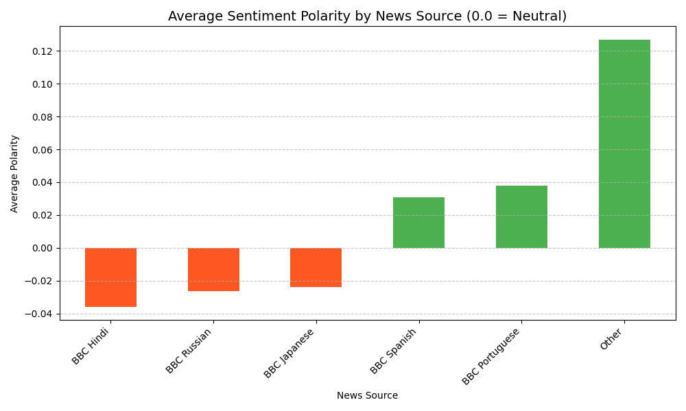

# 🌐 Multilingual News Sentiment & Entity Analysis Pipeline
Project Overview
This project implements an end-to-end automated data pipeline that scrapes top news headlines from six different BBC international language services, performs Natural Language Processing (NLP) for translation and sentiment analysis, and persists the results in a historical MySQL database. The output is then visualized in an interactive Power BI dashboard to track global news sentiment trends over time.

This project demonstrates proficiency across Python Automation, Web Scraping, NLP, Relational Database Design, and Business Intelligence (BI).

🛠️ Tech Stack & Key Skills
Category

Tools & Libraries Used

Skill Demonstrated

Automation & Orchestration

Python, run_full_pipeline.py

Full Pipeline Automation, Modular Code Design, sys.path management.

Data Acquisition

requests, BeautifulSoup4

Web Scraping, Handling Multilingual HTML/Encodings.

Data Processing & NLP

pandas, TextBlob, spaCy, deep_translator

Data Cleaning, Sentiment Analysis, Named Entity Recognition (NER).

Data Storage

MySQL (mysql.connector)

Relational Database Modeling (One-to-Many), Data Archiving for time-series analysis.

Visualization

Power BI, matplotlib

Interactive Dashboard Design, Time-Series Analysis, Data Modeling.

🚀 Pipeline Execution (The One-Click Run)
The entire pipeline, from scraping to database insertion, is automated and executed via a single command.

Prerequisites
Python 3.x

MySQL Server running locally (ensure port 3306 is open).

Power BI Desktop (for the final dashboard).

Dependencies: Install all required Python packages:

pip install -r requirements.txt
python -m spacy download en_core_web_sm

Configuration: Update the MySQL credentials in Data_Processing/db_connector.py.

Run Command
Execute the main automation script from the project root directory:

python run_full_pipeline.py

Output: The script sequentially runs the scraper, cleans and processes the data, generates Matplotlib charts, and appends all results to the historical newsanalysisdb database.

📊 Visualizations and Key Findings
This section is for showcasing the results of your hard work. Replace the placeholder links with screenshots of your actual output.

1. The Automated Dashboard (Power BI)
(Goal: Show the final, interactive dashboard with multiple visuals and slicers.)

[PLACEHOLDER: Add a link or image here of your Power BI Dashboard.]

Key Insight: [Example: Insert a brief summary of a key finding, e.g., "The average sentiment polarity across all sources showed a 15% drop over the last week, primarily driven by negative headlines in BBC Russian and BBC Spanish."]

2. Matplotlib Analysis (Sentiment Distribution)
(Goal: Show the quick, in-code Matplotlib output that validates the scraping and sentiment logic.)

[PLACEHOLDER: Add a link or image here of your Sentiment Bar Chart.]

Key Insight: [Example: "BBC Portuguese consistently reported the highest average sentiment (0.15), while BBC Hindi had the most neutral reporting (0.01) across the sampling period."]

3. Database Schema (Relational Model)
(Goal: Show the data model in Power BI or MySQL Workbench to highlight the relational design.)

[PLACEHOLDER: Add a link or image here of your Power BI Data Model View.]

Schema Note: Data is archived in two tables linked by a One-to-Many relationship (headlines.id -> entities.headline_id), ensuring accurate count of Named Entities per headline for historical analysis.

📁 Project Structure
News_Sentiment_Analysis/
├── Data_Processing/
│   ├── analysis_functions.py    # Cleaning, Pandas processing, Matplotlib charts
│   ├── db_connector.py          # MySQL connection and insertion logic
│   └── Data_Output/             # Cleaned CSVs and charts
├── Scraping_Scripts/
│   └── web_scraper.py           # Core scraping, translation, and NLP logic
├── run_full_pipeline.py         # Master automation script (One-click execution)
└── requirements.txt             # Project dependencies
