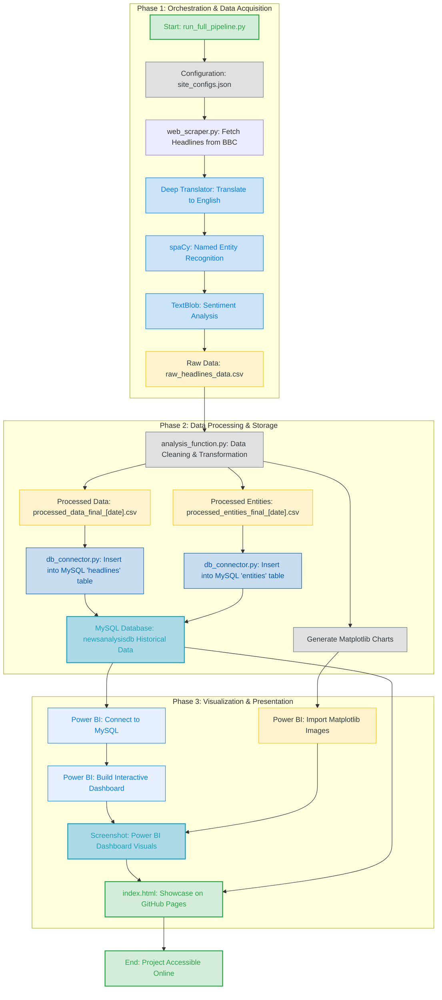

# 🌐 Multilingual News Sentiment & Entity Analysis Pipeline
Project Overview
This project implements an end-to-end automated data pipeline that scrapes top news headlines from six different BBC international language services, performs Natural Language Processing (NLP) for translation and sentiment analysis, and persists the results in a historical MySQL database. The output is then visualized in an interactive Power BI dashboard to track global news sentiment trends over time.

This project demonstrates proficiency across Python Automation, Web Scraping, NLP, Relational Database Design, and Business Intelligence (BI).

## 🛠️ Tech Stack & Key Skills

| Category | Tools & Libraries Used | Skill Demonstrated | 
 | ----- | ----- | ----- | 
| **Automation & Orchestration** | **Python**, `run_full_pipeline.py` | Full Pipeline Automation, Modular Code Design, `sys.path` management. | 
| **Data Acquisition** | `requests`, `BeautifulSoup4` | Web Scraping, Handling Multilingual HTML/Encodings. | 
| **Data Processing & NLP** | `pandas`, `TextBlob`, `spaCy`, `deep_translator` | Data Cleaning, Sentiment Analysis, Named Entity Recognition (NER). | 
| **Data Storage** | **MySQL** (`mysql.connector`) | Relational Database Modeling (One-to-Many), Data Archiving for time-series analysis. | 
| **Visualization** | **Power BI**, `matplotlib` | Interactive Dashboard Design, Time-Series Analysis, Data Modeling. | 

## 🚀 Pipeline Execution (The One-Click Run)
The entire pipeline, from scraping to database insertion, is automated and executed via a single command.

**Prerequisites**
1. Python 3.x

2. MySQL Server running locally (ensure port 3306 is open).

3. Power BI Desktop (for the final dashboard).

4. Dependencies: Install all required Python packages:

`pip install -r requirements.txt`
`python -m spacy download en_core_web_sm`

5. Configuration: Update the MySQL credentials in Data_Processing/db_connector.py.

**Run Command**

Execute the main automation script from the project root directory:

`python run_full_pipeline.py`

Output: The script sequentially runs the scraper, cleans and processes the data, generates Matplotlib charts, and appends all results to the historical newsanalysisdb database.
## Process Snapshots

* ### Initial Data collection*

### Data cleaned and saved to MySQL

### Data viewed and accessed on MySQL workbench

## 📊 Visualizations and Key Findings

### Showcasing a TreeMap for entities variance in the headlines

### Database Schema (Relational Model)

Schema Note: Data is archived in two tables linked by a One-to-Many relationship (headlines.id -> entities.headline_id), ensuring accurate count of Named Entities per headline for historical analysis.

**For more POWER BI visualization and matplotlib analysis got to->** [Click](https://akul-afk.github.io/Multilingual-News-Sentiment-Entity-Analysis-Pipeline/)
 
> 📁 Project Structure

> News_Sentiment_Analysis/

> ── Data_Processing/

>         ├── analysis_functions.py    # Cleaning, Pandas processing, Matplotlib charts

>         ├── db_connector.py          # MySQL connection and insertion logic

>         └── Data_Output/             # Cleaned CSVs and charts

> ── Scraping_Scripts/

>           └── web_scraper.py           # Core scraping, translation, and NLP logic

> ── run_full_pipeline.py         # Master automation script (One-click execution)

> ── requirements.txt             # Project dependencies

